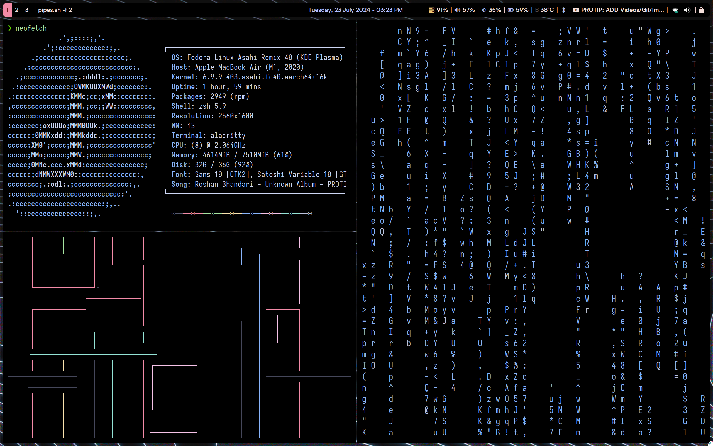
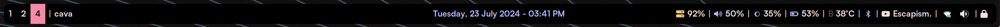
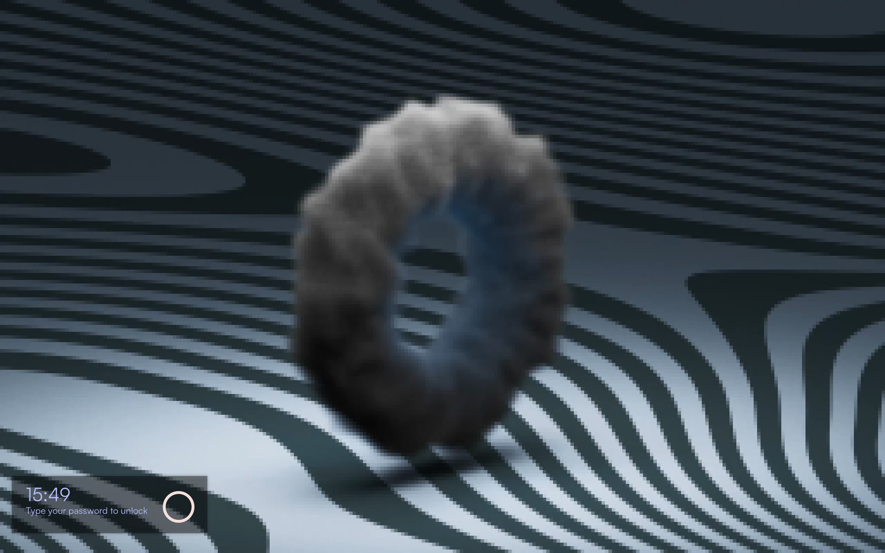

# Dotfiles [Asahi Linux](https://asahilinux.org)
This my personal dotfiles of i3wm, polybar, alacritty on Fedora 40 Remix (asahi linux m1 mac).

## My daily use Programms
- i3
- polybar (status bar)
- alacritty (terminal)
- tmux 
- nvim (coding environment)
- OBS (Screen Recording)
- firefox
- boomer (zooming util)
- betterlockscreen
- sddm 

> [!NOTE]  
> Boomer is not available for ARM64, so you need to build it from the source. To build it, you will need Nim and Nimble, but these packages do not exist for ARM64 either, so you will also have to build them from the source. I will upload a blog post on building Boomer from the source. You can wait for it or build it yourself. Good luck!

## Fedora 40 Remix Asahi Linux on MacBook Air M1 2020
 

## Wallpaper
 

## Polybar

## Lock Screen

